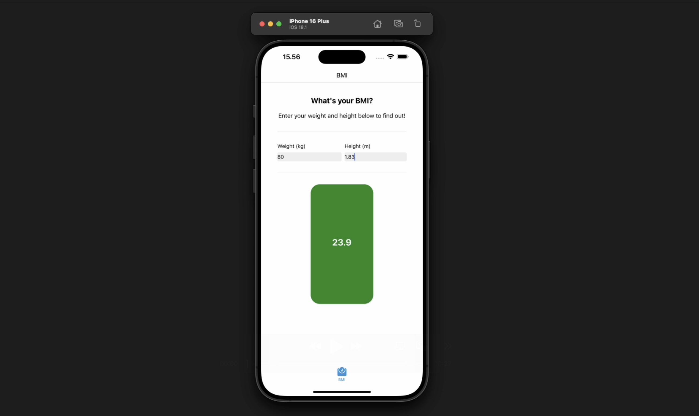

# BMI ⚛️ A React Native teaching app 

This repository contains code for a BMI calculation app, implemented in React Native. 

It's nothing special - barely more than a single file - but serves a purpose: To be the friendly, simple for teaching and tutorials about all things React Native.

## Tutorials

Life has intervened, these last couple months, so I haven't got much to show off down here just yet.

Here are some things I'd like to talk about, using this app, when I get the time. Each tutorial will be implemented on a different branch of the app:

- How does React Native Reanimated work, exactly? - [Video](https://www.youtube.com/watch?v=ydtJC898T74) - [Branch]
- How do you setup automated end-to-end testing of a React Native app? - _To come._
- What is React Native Skia? - _To come._
- How to setup Storybook in a React Native project - _To come._
- etc.

